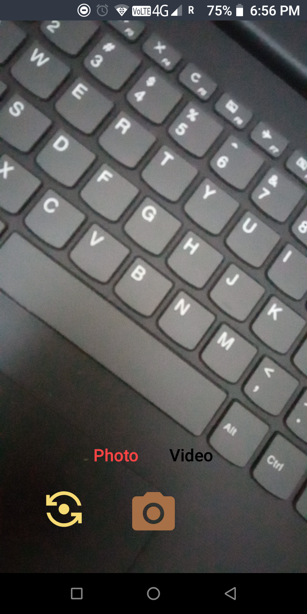
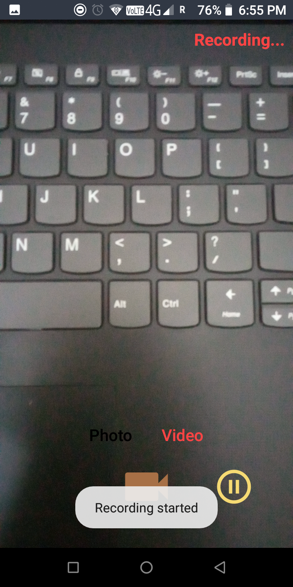
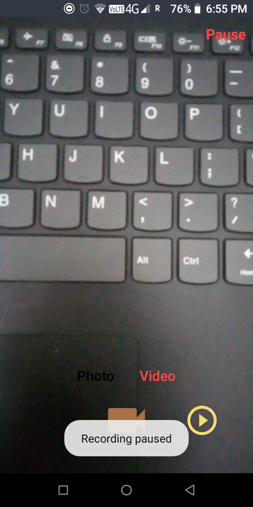
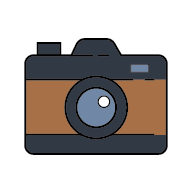

## **MyCamera**
Camera app for android. 
* Switch b/w front and back camera. 
* Capture image. 
* Record video.

## **Screenshot**
   

## **Icon**

## **Apk**
[app-debug.apk](src/app-debug.apk?raw=true)

## **License**
Licensed under the [MIT License](LICENSE)
